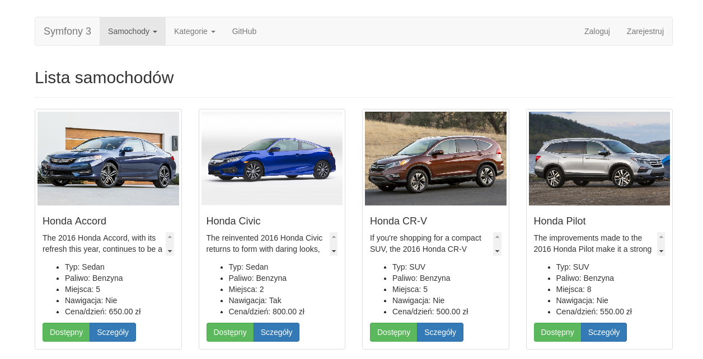
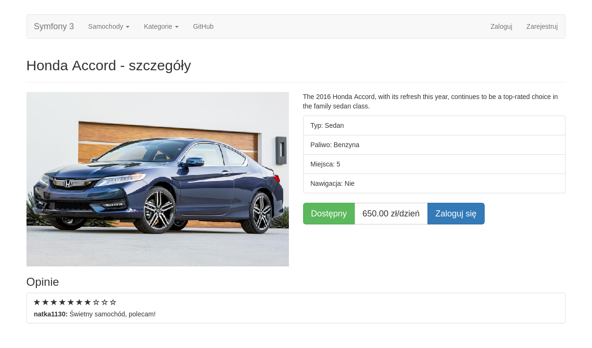
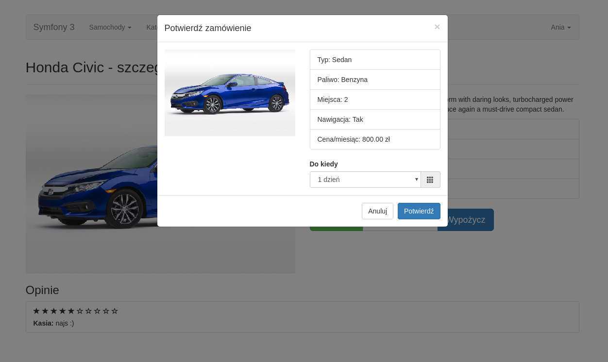
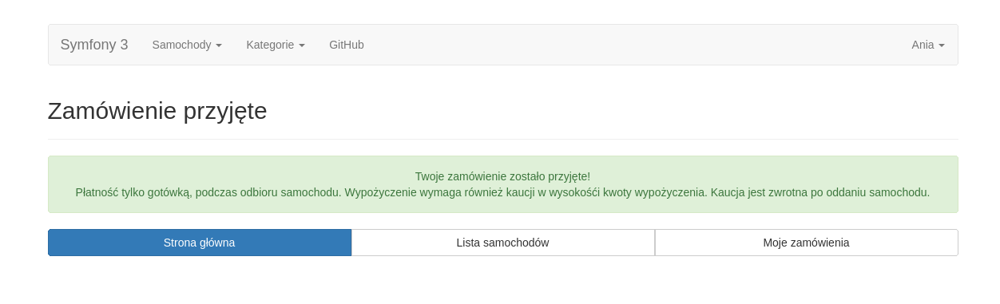
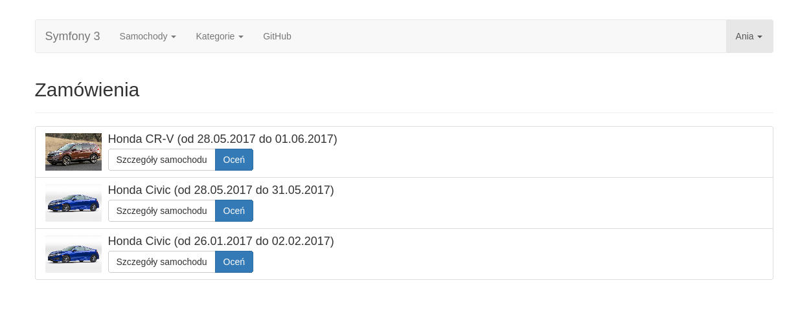

# Symfony 3 Car-Rent Sample with Demo

* @Author: TimsManter
* @AuthorSite: [TimsManter.NET](http://timsmanter.net/)
* @CreateDate: 2016-01
* @AbandonDate: 2016-03
* @Editor: PhpStorm
* @Language: PHP
* @Framework: Symfony
* @Locale: pl_PL
* @License: [MIT](LICENSE.md)
* @Status: Beta | Obsolete | Sample
* @ProjectSite: [Car Rent Demo](http://sfs.timsmanter.net/)

<!-- TOC -->

- [Overview](#overview)
- [Live Demo](#live-demo)
  - [Accounts](#accounts)
- [Scrrenshots](#scrrenshots)
- [Installation](#installation)
  - [Database](#database)
    - [cars](#cars)
    - [categories](#categories)
    - [users](#users)
- [Roles](#roles)

<!-- /TOC -->

## Overview

Just a simple demo which shows how to create a simple app in Symfony 3
to rent cars by users and moderate orders.

## Live Demo

URL: [sfs.timsmanter.net](http://sfs.timsmanter.net/)

### Accounts

Login | Password | Role
------|----------|-----
Kasia |kasia     |USER
Ania  |ania      |USER
Stefan|stefan    |USER
Mod   |mod       |MOD

## Scrrenshots

|||
---|---
 | 
 | 

## Installation

1. Install Composer
2. Clone this repository
3. Install dependencies via command `composer install` in project directory
4. Set all necessary database settings
5. Create schema by command `php bin/console doctrine:database:create --force`
6. Fill database. Example:

### Database

#### cars
id|name|category_id|image|description|parameters|price
:---:|:---:|:---:|:---:|:---:|:---:|:---:
...|...|...|...|...|...|...
2|Honda Accord|2|2.jpg|(description text)|Gasoline;5;No|500.00
...|...|...|...|...|...|...

#### categories
id|name
:---:|:---:
1|SUV
2|Sedan
...|...

#### users
id|username|mail|password|roles
:---:|:---:|:---:|:---:|:---:
1|Jack|jack(at)example.com|jack123|ROLE_USER
2|Megan|megan(at)example.com|megan456|ROLE_MOD
...|...|...|...|...

**Tip:** You can create users by registration form and then give them right roles.

## Roles

Activity|ANON|USER|MOD
---|:---:|:---:|:---:
register            |+|-|-
login               |-|+|+
show cars           |+|+|+
show cars sorted    |+|+|+
show categories     |+|+|+
show car status     |+|+|+
show car details    |+|+|+
show opinions       |+|+|+
show orders         |-|+|+
order cars          |-|+|+
add opinions        |-|+|+
accept opinions     |-|-|+
remove opinions     |-|-|+